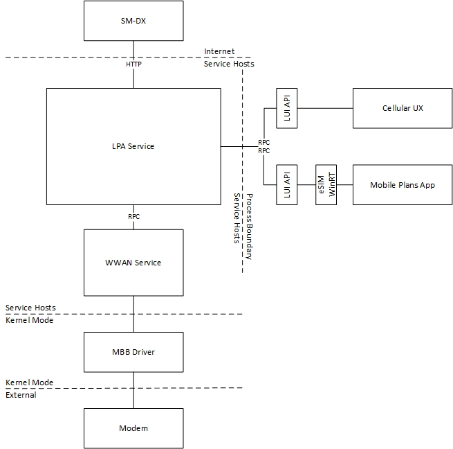
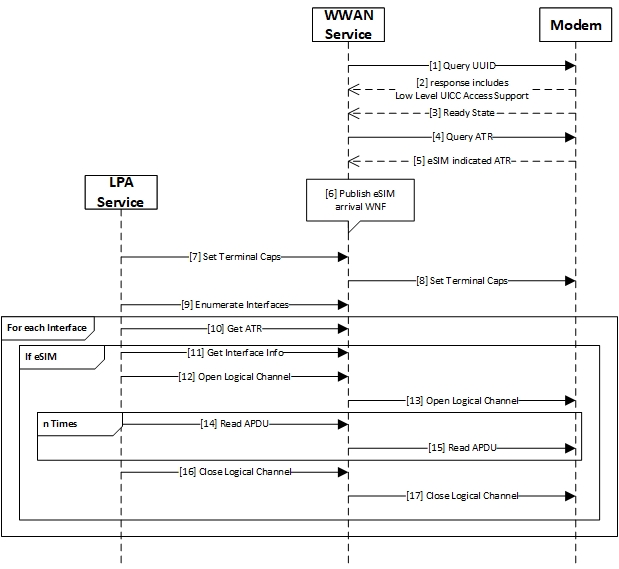
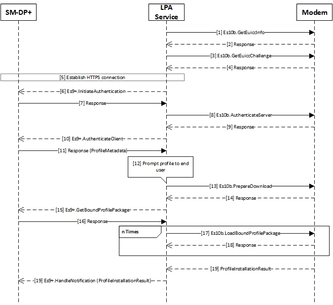
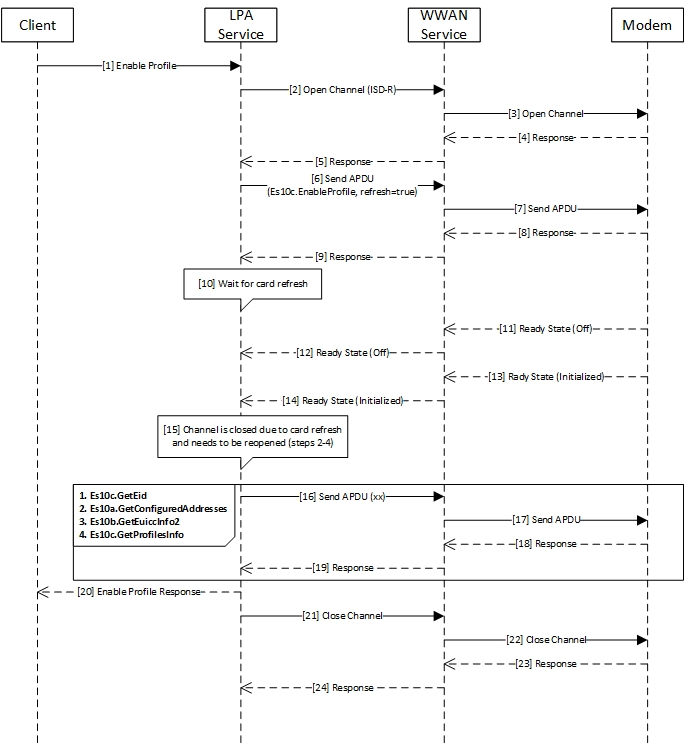

# MB eSIM Operations

## eSIM Architecture

The LPA component of the Windows operating system is LPA Service while the low level UICC access is be exposed through WWAN service. LPA Service handles profile discovery, download profies and profile management.



## MB Interface Update for eSIM Operations

Modem needs to support the [MB Low Level UICC access CIDs](mb-low-level-uicc-access.md) for eSIM Functionality.

```
 MBIM_CID_MS_UICC_ATR 
 MBIM_CID_MS_UICC_OPEN_CHANNEL
 MBIM_CID_MS_UICC_CLOSE_CHANNEL 
 MBIM_CID_MS_UICC_APDU
 MBIM_CID_MS_UICC_TERMINAL_CAPABILITY
 MBIM_CID_MS_UICC_RESET
 ```

## eSIM Service Initialization



### Description

LPA Service 

## eSIM Profile Download and Install



### Description

LPA Service follows the Spec for Download and Install

## eSIM Profile Operations

eSIM Profile Operations include 
```
Enable Profile
Disable Profile
Delete Profile
Wipe eSIM
Update NickName
```

Below is a sample flow for Enable Profile. The other Profile operations follow a similar flow except that the MBIM_CID_MS_UICC_APDU with contain the Es10c command for the respective operation.



### Card Refresh
The following operations expect card reset Operation that needs to be followed as per the guidance in [MB eSIM MBIM ready state guidance](mb-esim-mbim-ready-state-guidance.md)


